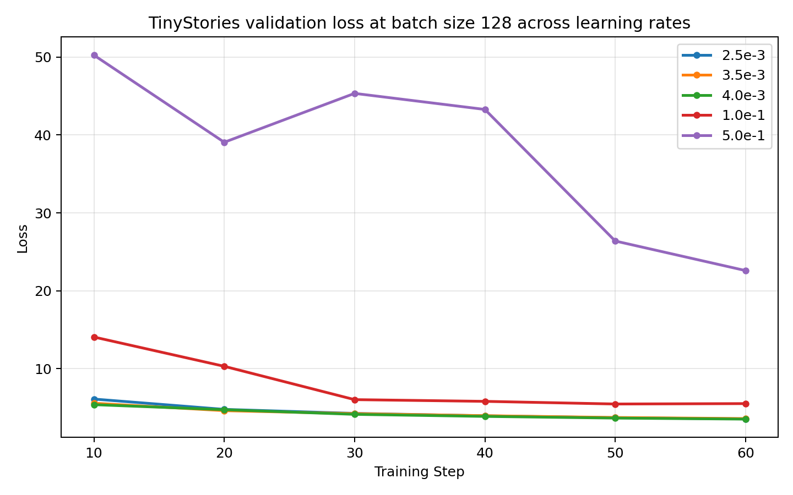
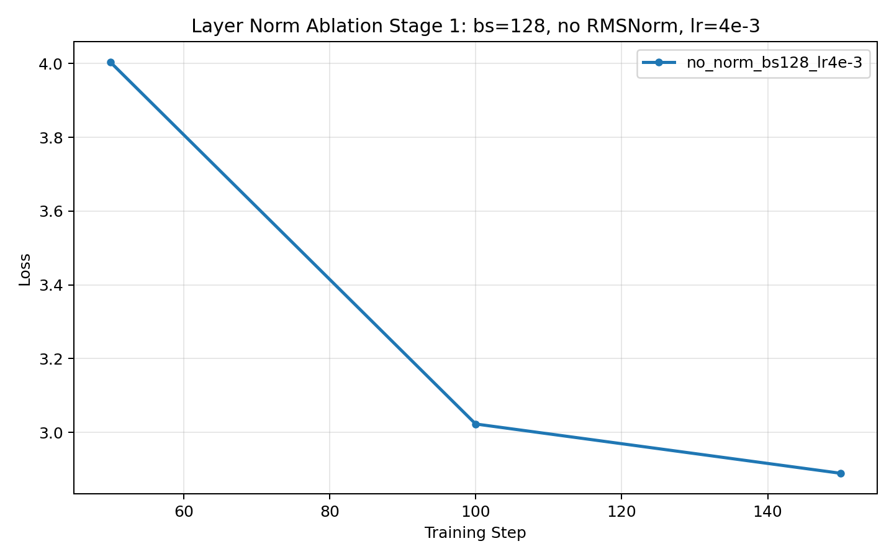

## Problem `unicode1`: Understanding Unicode (1 point)

### (a)
**Question:** What Unicode character does `chr(0)` return?  
**Deliverable:** A one-sentence response.

**Answer:** `chr(0)` returns the null character (Unicode code point U+0000, often written as `'\x00'`).

### (b)
**Question:** How does this character’s string representation (`__repr__()`) differ from its printed representation?  
**Deliverable:** A one-sentence response.

**Answer:** Its string representation is the escaped form (e.g., `'\x00'`), while printing it outputs an invisible control character.

### (c)
**Question:** What happens when this character occurs in text?  
**Deliverable:** A one-sentence response.

**Answer:** When this character appears in text, it is invisible to readers and can cause issues in systems that treat null bytes as terminators or control characters.

---

## Problem `unicode2`: Unicode Encodings (3 points)

### (a)
**Question:** What are some reasons to prefer training our tokenizer on UTF-8 encoded bytes, rather than UTF-16 or UTF-32?  
**Deliverable:** A one-to-two sentence response.

**Answer:** UTF-8 is already widely used across modern systems, operating systems, and applications, so training on UTF-8 data usually leads to fewer compatibility issues in real pipelines. Compared with UTF-16 or UTF-32, UTF-8 also tends to be a more practical compression tradeoff for mixed-language text (for example, many English characters use one byte while many Chinese characters use three bytes), which is often more suitable for tokenizer and model training.

### (b)
**Question:** Consider the following (incorrect) function intended to decode a UTF-8 byte string into a Unicode string. Why is this function incorrect? Provide an example input byte string that yields incorrect results.

```python
def decode_utf8_bytes_to_str_wrong(bytestring):
    return "".join([bytes([b]).decode("utf-8") for b in bytestring])
```

**Deliverable:** An example input byte string for which `decode_utf8_bytes_to_str_wrong` produces incorrect output, with a one-sentence explanation.

**Answer (example bytes):** `b'\xe6\xb1\x89'`  
**Answer (explanation):** This function is incorrect because it decodes UTF-8 one byte at a time; for multi-byte characters such as `汉` (`b'\xe6\xb1\x89'`), the bytes must be decoded together, otherwise it raises a `UnicodeDecodeError` or produces incorrect decoding behavior.

### (c)
**Question:** Give a two-byte sequence that does not decode to any Unicode character(s).  
**Deliverable:** An example, with a one-sentence explanation.

**Answer (example bytes):** `b'\xff\xff'`  
**Answer (explanation):** This is invalid in UTF-8 because `0xFF` is not allowed as a valid UTF-8 byte in any position.

---

## Problem `train_bpe_tinystories`: BPE Training on TinyStories (2 points)

### (a)
**Question:** Train a byte-level BPE tokenizer on TinyStories with max vocab size 10,000 and include `<|endoftext|>` as a special token. Serialize vocab and merges. Report: training hours and memory usage; longest token in vocabulary; whether it makes sense.  
**Deliverable:** A one-to-two sentence response.

**Answer:**
Training a 10,000-vocabulary byte-level BPE tokenizer on the full TinyStories training set (with `<|endoftext|>` included as a special token) took about 37.65 seconds (about 0.0105 hours), with peak main-process RSS around 0.233 GB. The longest token was `" responsibility"` (15 bytes), which is plausible because BPE tends to merge frequent whitespace-prefixed word pieces.

### (b)
**Question:** Profile your code. What part of tokenizer training takes the most time?  
**Deliverable:** A one-to-two sentence response.

**Answer:**
Profiling shows that after pre-tokenization parallelization, the dominant cost shifts to the merge stage, especially best-pair selection and heap-based pair-count maintenance (e.g., `pop_best_pair_lazy` and `_heapq.heappop`-related paths). In other words, regex pre-tokenization is no longer the primary bottleneck in the optimized implementation.

**Evidence paths (profiles/logs):**
- `artifacts/experiments/tokenizer/tinystories_10k_train_w16/report.json`
- `artifacts/experiments/tokenizer/tinystories_10k_train_w16/train.prof`
- `artifacts/experiments/tokenizer/tinystories_10k_train_w16/README.md`

---

## Problem `train_bpe_expts_owt`: BPE Training on OpenWebText (2 points)

### (a)
**Question:** Train a byte-level BPE tokenizer on OpenWebText with max vocab size 32,000. Serialize vocab and merges. What is the longest token in the vocabulary? Does it make sense?  
**Deliverable:** A one-to-two sentence response.

**Answer:**
Training the 32,000-vocabulary byte-level BPE tokenizer on OpenWebText completed in about 19,509.0 seconds (about 5.42 hours), and the longest token is a 64-byte run of hyphens (`"----------------------------------------------------------------"`). This is reasonable for web text, where repeated punctuation sequences are common and can become frequent merge targets.

### (b)
**Question:** Compare and contrast the tokenizer trained on TinyStories vs. the tokenizer trained on OpenWebText.  
**Deliverable:** A one-to-two sentence response.

**Answer:**
The TinyStories tokenizer (10K vocab) is more concentrated on simple narrative English (its longest token is `" responsibility"` at 15 bytes), while the OpenWebText tokenizer (32K vocab) captures a much broader and noisier web distribution, including long punctuation-heavy tokens. In practice, the OWT tokenizer should generally compress OWT-like text better, while the TinyStories tokenizer is more specialized to children-story style text.

**Evidence paths (artifacts/logs):**
- `artifacts/experiments/tokenizer/tinystories_10k_train_w16/report.json`
- `artifacts/experiments/tokenizer/owt_32k_train_w16/report.json`
- `artifacts/experiments/tokenizer/owt_32k_train_w16/README.md`

---

## Problem `tokenizer_experiments`: Experiments with tokenizers (4 points)

### (a)
**Question:** Sample 10 documents from TinyStories and OpenWebText. Using the previously trained TinyStories (10K) and OpenWebText (32K) tokenizers, encode sampled documents. What is each tokenizer’s compression ratio (bytes/token)?  
**Deliverable:** A one-to-two sentence response.

**Answer:**
On the 10-document samples, the TinyStories tokenizer (10K) achieves 4.0112 bytes/token on the TinyStories sample and 3.4046 bytes/token on the OpenWebText sample. The OpenWebText tokenizer (32K) achieves 4.5050 bytes/token on the OpenWebText sample and 3.8672 bytes/token on the TinyStories sample.

### (b)
**Question:** What happens if you tokenize your OpenWebText sample with the TinyStories tokenizer? Compare compression ratio and/or qualitatively describe behavior.  
**Deliverable:** A one-to-two sentence response.

**Answer:**
When tokenizing OpenWebText with the TinyStories tokenizer, compression drops from 4.5050 to 3.4046 bytes/token (OpenWebText tokenizer vs. TinyStories tokenizer on the same OWT sample), and token count increases from 11,201 to 14,821 for the same 50,460 bytes. This indicates stronger segmentation/fragmentation under domain mismatch: the smaller, story-domain tokenizer has fewer useful merges for noisier web text patterns.

### (c)
**Question:** Estimate tokenizer throughput (bytes/second). How long would it take to tokenize The Pile dataset (825GB of text)?  
**Deliverable:** A one-to-two sentence response.

**Answer:**
Using the OpenWebText tokenizer (32K) on a 50MB OpenWebText validation slice, measured throughput is about 3,787,835 bytes/second (about 867,689 tokens/second). Extrapolating linearly to 825GB gives an estimated tokenization time of about 217,802 seconds, or 60.5 hours.

### (d)
**Question:** Using TinyStories and OpenWebText tokenizers, encode train/dev datasets into integer IDs. We recommend serializing IDs as NumPy `uint16`. Why is `uint16` appropriate?  
**Deliverable:** (Written explanation required for `uint16` choice.)

**Answer:**
`uint16` is appropriate because both tokenizer vocabularies are far below 65,536 entries (TinyStories: 10,000; OpenWebText: 32,000), so every valid token ID fits safely in 16 bits. This cuts storage roughly in half versus `int32` while still preserving exact token IDs, and our encoding pipeline explicitly checks for overflow before casting to `uint16`, so successful corpus encoding confirms the dtype is valid for these tokenizers.

---

## Problem `transformer_accounting`: Transformer LM resource accounting (5 points)

### (a)
**Question:** For GPT-2 XL (`vocab_size=50,257`, `context_length=1,024`, `num_layers=48`, `d_model=1,600`, `num_heads=25`, `d_ff=6,400`), how many trainable parameters does the model have? Assuming float32 parameters, how much memory is needed to load the model?  
**Deliverable:** A one-to-two sentence response.

**Answer:**
Let `V = vocab_size`, `T = context_length`, `L = num_layers`, `D = d_model`, `H = num_heads`, and `F = d_ff`.
For this assignment's `TransformerLM` implementation, the parameter count is
`token_embeddings + num_layers * (attention + FFN + RMSNorm) + ln_final + lm_head`, where
`token_embeddings = V * D`, `attention = 4 * D^2`, `FFN = 3 * D * F`, and
`RMSNorm = 2 * D` per block. Plugging in `V = 50,257`, `L = 48`,
`D = 1600`, and `F = 6400` gives
`2 * V * D + L * (4 * D^2 + 3 * D * F + 2 * D) + D = 2 * 50257 * 1600 + 48 * (4 * 1600^2 + 3 * 1600 * 6400 + 2 * 1600) + 1600 = 2,127,057,600`
trainable parameters (about `2.13B`); at float32 (`4` bytes per parameter), this requires
`2,127,057,600 * 4 = 8,508,230,400` bytes, or about `8.51 GB` (`7.92 GiB`), just to store the parameters.
These values are checked by `artifacts/experiments/transformer_accounting/verify_gpt2_xl_accounting.py`.

### (b)
**Question:** Identify the matrix multiplies required for one forward pass of the GPT-2 XL-shaped model. How many FLOPs do they require in total (sequence length = `context_length`)?  
**Deliverable:** A list of matrix multiplies (with descriptions), and total FLOPs.

**Answer:**
Let `V = vocab_size`, `T = context_length`, `L = num_layers`, `D = d_model`, `H = num_heads`, and `F = d_ff`, with `d_k = D / H`.
Using the handout rule that a matrix multiply `(m x n) @ (n x p)` costs `2mnp` FLOPs, the forward-pass cost is
`L * (8 * T * D^2 + 4 * T^2 * D + 6 * T * D * F) + 2 * T * D * V`, where
`8 * T * D^2` comes from the four attention projections, `4 * T^2 * D` comes from `QK^T` and `A @ V`,
`6 * T * D * F` comes from the three FFN multiplies, and `2 * T * D * V` comes from the final `lm_head`.
Assuming a single input sequence of length `T = 1024`, with `L = 48`, `D = 1600`, `H = 25`, `d_k = D / H = 64`, `F = 6400`, and `V = 50257`, the matrix multiplies in one forward pass are:

- Per layer attention projections:
  - `X @ W_Q`: `2 * T * D * D = 2 * 1024 * 1600 * 1600 = 5,242,880,000`
  - `X @ W_K`: `5,242,880,000`
  - `X @ W_V`: `5,242,880,000`
  - `concat(heads) @ W_O`: `5,242,880,000`
- Per layer attention score/value products:
  - `Q @ K^T`: `2 * H * T * d_k * T = 2 * 25 * 1024 * 64 * 1024 = 3,355,443,200`
  - `A @ V`: `3,355,443,200`
- Per layer FFN:
  - `X @ W_1`: `2 * T * D * F = 2 * 1024 * 1600 * 6400 = 20,971,520,000`
  - `X @ W_3`: `20,971,520,000`
  - `gate @ W_2`: `2 * T * F * D = 20,971,520,000`

This gives `90,596,966,400` FLOPs per Transformer layer, so the `48` blocks require `4,348,654,387,200` FLOPs in total. The final language-model head adds `2 * T * D * V = 2 * 1024 * 1600 * 50257 = 164,682,137,600` FLOPs, giving a total of `4,513,336,524,800` FLOPs for one forward pass. These values are checked by `artifacts/experiments/transformer_accounting/verify_gpt2_xl_accounting.py`.

### (c)
**Question:** Based on your analysis, which parts of the model require the most FLOPs?  
**Deliverable:** A one-to-two sentence response.

**Answer:**
Using the component decomposition from part (b), the dominant term is the FFN block (`W_1`, `W_3`, `W_2`), which contributes about `66.9%` of the total forward-pass FLOPs. The next largest contributor is the attention projection stack (`Q/K/V/O`) at about `22.3%`, while `QK^T`, `A @ V`, and the final `lm_head` each contribute only a few percent.

### (d)
**Question:** Repeat analysis for GPT-2 small (12L, 768d, 12H), medium (24L, 1024d, 16H), and large (36L, 1280d, 20H). As model size increases, which components take proportionally more or less FLOPs?  
**Deliverable:** For each model, provide component-wise FLOP breakdown (proportion of total), plus a one-to-two sentence summary.

**Answer:**
Using the same notation as above, with `V = vocab_size`, `T = context_length`, `L = num_layers`, `D = d_model`, `H = num_heads`, and `F = d_ff`, the total forward-pass FLOPs are
`total = L * (8 * T * D^2 + 4 * T^2 * D + 6 * T * D * F) + 2 * T * D * V`.
Using this formula,
I break the total into five components: attention projections, attention scores (`QK^T`), attention values (`A @ V`), FFN, and `lm_head`. The forward-pass FLOP breakdowns are:

- **GPT-2 small**
  - attention projections: `57,982,058,496` FLOPs (`16.58%`)
  - attention scores (`QK^T`): `19,327,352,832` FLOPs (`5.53%`)
  - attention values (`A @ V`): `19,327,352,832` FLOPs (`5.53%`)
  - FFN: `173,946,175,488` FLOPs (`49.75%`)
  - `lm_head`: `79,047,426,048` FLOPs (`22.61%`)

- **GPT-2 medium**
  - attention projections: `206,158,430,208` FLOPs (`19.96%`)
  - attention scores (`QK^T`): `51,539,607,552` FLOPs (`4.99%`)
  - attention values (`A @ V`): `51,539,607,552` FLOPs (`4.99%`)
  - FFN: `618,475,290,624` FLOPs (`59.87%`)
  - `lm_head`: `105,396,568,064` FLOPs (`10.20%`)

- **GPT-2 large**
  - attention projections: `483,183,820,800` FLOPs (`21.40%`)
  - attention scores (`QK^T`): `96,636,764,160` FLOPs (`4.28%`)
  - attention values (`A @ V`): `96,636,764,160` FLOPs (`4.28%`)
  - FFN: `1,449,551,462,400` FLOPs (`64.20%`)
  - `lm_head`: `131,745,710,080` FLOPs (`5.84%`)

At fixed context length, increasing model size makes the `O(T * d_model^2)` terms more dominant, especially the FFN and attention projection layers. In contrast, the `O(T^2 * d_model)` attention matrix products and the final `lm_head` take up a smaller fraction of total FLOPs as `d_model` and `num_layers` grow.

### (e)
**Question:** For GPT-2 XL, increase context length to 16,384. How do total forward FLOPs and relative component contributions change?  
**Deliverable:** A one-to-two sentence response.

**Answer:**
Under the same formula, increasing context length mainly changes the balance between the `O(T * D^2)` terms and the `O(T^2 * D)` attention-matrix terms. For GPT-2 XL, increasing `T` from `1024` to `16,384` raises the total forward-pass FLOPs from `4,513,336,524,800` to `149,522,795,724,800` (about `33.1x`), and the combined share of `QK^T` plus `A @ V` grows from about `7.14%` to about `55.15%`, making long-context attention much more dominant.

---

## Problem `learning_rate_tuning`: Tuning the learning rate (1 point)

**Question:** Run the toy SGD example with learning rates `1e1`, `1e2`, and `1e3` for 10 iterations. What happens to loss for each LR (faster decay, slower decay, or divergence)?  
**Deliverable:** A one-to-two sentence response.

**Answer:**  
With a learning rate of `1e1`, the loss decreases steadily but more slowly than with `1e2`. A learning rate of `1e2` reduces the loss faster, while `1e3` causes the optimization to diverge rather than converge.

---

## Problem `adamwAccounting`: Resource accounting for training with AdamW (2 points)

### (a)
**Question:** Compute peak memory for AdamW training in float32. Decompose into parameters, activations, gradients, optimizer state. Express in terms of `batch_size`, `vocab_size`, `context_length`, `num_layers`, `d_model`, `num_heads` (assume `d_ff = 4 * d_model`).  
**Deliverable:** Algebraic expression for each component and total.

**Answer:**  
Let `B = batch_size`, `V = vocab_size`, `T = context_length`, `L = num_layers`, `D = d_model`, `H = num_heads`, and `d_ff = 4D`. Since all tensors are in float32, each stored element uses `4` bytes.

The total number of model parameters is

`P = 2VD + L(16D^2 + 2D) + D,`

where `2VD` comes from the input embedding and output projection, each Transformer block contributes `4D^2` attention parameters, `12D^2` SwiGLU parameters, and `2D` RMSNorm parameters, and the final RMSNorm contributes `D`.

Therefore, parameter memory is

`M_params = 4P = 4[2VD + L(16D^2 + 2D) + D].`

Gradient memory matches parameter memory because each parameter has a float32 gradient tensor of the same shape:

`M_grads = 4P = 4[2VD + L(16D^2 + 2D) + D].`

For AdamW, the optimizer state stores two float32 tensors per parameter, the first and second moments (`m` and `v`), so

`M_opt = 8P = 8[2VD + L(16D^2 + 2D) + D].`

For activations, counting only the intermediates explicitly listed in the handout:

- per Transformer block:
  - two RMSNorm outputs: `2BTD`
  - attention sublayer:
    - `Q`, `K`, `V` projections: `3BTD`
    - `QK^T`: `BHT^2`
    - softmax output: `BHT^2`
    - weighted sum of values: `BTD`
    - output projection: `BTD`
  - position-wise feed-forward:
    - `W_1` output: `4BTD`
    - SiLU output: `4BTD`
    - `W_2` output: `BTD`

So each block contributes

`16BTD + 2BHT^2`

activation elements. Adding the final RMSNorm output (`BTD`), output embedding / logits (`BTV`), and cross-entropy on logits (`BTV`) gives

`M_acts = 4[L(16BTD + 2BHT^2) + BTD + 2BTV].`

The total peak memory is therefore

`M_total = M_params + M_acts + M_grads + M_opt`

`= 16[2VD + L(16D^2 + 2D) + D] + 4[L(16BTD + 2BHT^2) + BTD + 2BTV].`

### (b)
**Question:** Instantiate for GPT-2 XL so expression depends only on `batch_size`. What maximum `batch_size` fits in 80GB?  
**Deliverable:** Expression of form `a * batch_size + b`, and max batch size.

**Answer:**  
For GPT-2 XL, using `V = 50,257`, `T = 1,024`, `L = 48`, `D = 1,600`, and `H = 25`, the total memory expression from part `(a)` becomes

`M_total(B) = 15,517,753,344 * B + 34,032,921,600` bytes,

where the linear term comes from activations and the constant term comes from parameters, gradients, and AdamW optimizer state. If we interpret `80GB` in decimal units as `80,000,000,000` bytes, then the maximum batch size is `2`, since `B = 3` would require `80,586,181,632` bytes. (If one instead uses the binary convention `80 GiB = 80 * 1024^3` bytes, the answer would be `3`, but I use the decimal `80GB` wording from the prompt here.)

### (c)
**Question:** How many FLOPs does one AdamW step take?  
**Deliverable:** Algebraic expression with brief justification.

**Answer:**  
Let `B = batch_size`, `V = vocab_size`, `T = context_length`, `L = num_layers`, `D = d_model`, `H = num_heads`, and `d_ff = 4D`. Reusing the matrix-multiply accounting from `transformer_accounting`, the forward-pass FLOPs for a batch are

`F_forward = L(32BTD^2 + 4BT^2D) + 2BTDV.`

Using the standard approximation that the backward pass costs twice the forward pass, we have

`F_backward ≈ 2F_forward.`

For the AdamW optimizer update itself, treating elementwise arithmetic as constant-cost operations, each parameter contributes a constant number of FLOPs for updating the first moment `m`, second moment `v`, the Adam parameter update, and the decoupled weight decay update. Concretely, for each parameter element:

- first-moment update
  `m <- beta_1 m + (1 - beta_1) g`
  costs about `3` FLOPs (`2` multiplies and `1` addition),
- second-moment update
  `v <- beta_2 v + (1 - beta_2) g^2`
  costs about `4` FLOPs (`1` multiply for `g^2`, `2` more multiplies, and `1` addition),
- Adam parameter update
  `theta <- theta - alpha_t m / (sqrt(v) + eps)`
  costs about `5` FLOPs (`sqrt`, add `eps`, divide, multiply, subtract),
- decoupled weight decay
  `theta <- theta - alpha lambda theta`
  costs about `3` FLOPs (`2` multiplies and `1` subtraction).

This gives about `3 + 4 + 5 + 3 = 15` FLOPs per parameter element, so a convenient accounting is

`F_opt ≈ 15P,`

where

`P = 2VD + L(16D^2 + 2D) + D`

is the total number of parameters. Therefore, one AdamW training step requires approximately

`F_step ≈ F_forward + F_backward + F_opt = 3F_forward + 15P`

`= 3[L(32BTD^2 + 4BT^2D) + 2BTDV] + 15[2VD + L(16D^2 + 2D) + D].`

The dominant term is the forward/backward model computation; the optimizer update is lower-order in practice because it is only linear in the parameter count.

### (d)
**Question:** A100 FP32 peak is 19.5 TFLOP/s. Assuming 50% MFU, how long (days) to train GPT-2 XL for 400K steps with batch size 1024 on one A100? Assume backward FLOPs = 2x forward FLOPs.  
**Deliverable:** Number of days with brief justification.

**Answer:**  
Using the forward-pass result from `transformer_accounting`, GPT-2 XL requires `4,513,336,524,800` FLOPs per sequence of length `1024`. With batch size `1024`, this gives `4,621,656,601,395,200` forward FLOPs per training step. Using the approximation `backward = 2 x forward`, plus the AdamW optimizer cost `F_opt = 15P = 31,905,864,000`, one step costs approximately `13,865,001,710,049,600` FLOPs in total. Over `400,000` steps this is `5.54600068401984e21` FLOPs, and at `50%` MFU on a single A100 the effective throughput is `0.5 * 19.5e12 = 9.75e12` FLOP/s, so training would take about `6,583.6` days (about `18.0` years). This is a hypothetical throughput estimate and does not require the batch size to satisfy the separate memory constraint from part `(b)`.

---

## Problem `learning_rate`: Tune the learning rate (3 points)

### (a)
**Question:** Sweep learning rates for the base TinyStories model and report final losses (or divergence).  
**Deliverable 1:** Learning curves for multiple LRs and explanation of hyperparameter search strategy.  
**Deliverable 2:** A model with TinyStories validation loss (per-token) of at most 1.45 (or adjusted target if using low-resource setting explicitly allowed by the handout).

**Answer:**

I reran the learning-rate search on the TinyStories baseline model using `batch_size=128`, since this batch size is a better fit for my hardware. The model configuration was otherwise unchanged (`vocab_size=10000`, `context_length=256`, `d_model=512`, `d_ff=1344`, `num_layers=4`, `num_heads=16`, `rope_theta=10000`). I used a two-stage search strategy: a broad 60-step pilot sweep to bracket the good region and the failure-side region, followed by a refined sweep around the local optimum.

The coarse sweep showed that the best region was near a few times `10^-3`, while much larger learning rates quickly degraded. In the refined sweep, the best learning rate was `4.0e-3`, with best validation loss `3.5015` at step `60`. Nearby values were all slightly worse (`2.5e-3 -> 3.5286`, `3.5e-3 -> 3.5669`, `4.5e-3 -> 3.7722`, `5.0e-3 -> 3.8112`), so the local optimum was clearly centered near `4e-3`.

I then used `learning_rate=4.0e-3` for a longer training run with `warmup_iters=200`, `beta1=0.9`, `beta2=0.999`, `eps=1e-8`, and `weight_decay=0.1`. With `batch_size=128` and `10000` steps, this run processed exactly `327,680,000` tokens and reached best validation loss `1.3234` at step `10000`, comfortably beating the assignment target of `1.45`. This is therefore the final learning rate I selected for the TinyStories model under the `batch_size=128` setting.



Figure: TinyStories validation-loss curves at `batch_size=128` for representative learning rates. The best region is centered near `4e-3`, while larger learning rates quickly degrade.

### (b)
**Question:** Investigate whether the best LR is “at the edge of stability.” Include increasing-LR curves with at least one divergent run, and analyze relation to convergence.

**Deliverable:** Learning curves and analysis.

**Answer:**

The `batch_size=128` rerun suggests that the best learning rate is not exactly at the literal numerical divergence boundary. The refined optimum was `4.0e-3`, but a range of larger values (`1.2e-2`, `2e-2`, `5e-2`) still trained for 60 steps without NaNs while giving clearly worse validation loss. In other words, there is a substantial "stable but degraded" region above the optimum.

At still larger learning rates, training became effectively unusable. In the same pilot setup, `1e-1` reached validation loss `5.4419`, `2e-1` reached `5.9544`, and `5e-1` reached `22.5846`. These runs did not numerically explode to NaN within the short pilot horizon, but they never entered a useful optimization regime and serve as clear failure-side references. So in this experiment the best learning rate is better described as lying near the lower edge of a broad degraded region, rather than exactly at the point of numerical divergence.


Figure: At `batch_size=128`, learning rates above the optimum quickly move from "worse but stable" into an unusable failure-side regime.

---

## Problem `batch_size_experiment`: Batch size variations (1 point)

**Question:** Vary batch size from 1 to memory limit (including intermediate values such as 64 and 128). Re-tune LR if needed.  
**Deliverable 1:** Learning curves for different batch sizes.  
**Deliverable 2:** A few sentences discussing findings.

**Answer:**

I varied batch size from `1` up to the largest configuration that completed cleanly in my sweep (`512`) and re-tuned the learning rate locally for each batch size using short 400-step pilots with the same model architecture and optimizer settings. The best learning rates increased monotonically with batch size: `1.0e-3` for `bs=1/2/4/8`, `1.5e-3` for `bs=16`, `2.0e-3` for `bs=32`, `3.0e-3` for `bs=64`, `4.0e-3` for `bs=128`, `8.0e-3` for `bs=256`, and `6.0e-3` for `bs=512`.

At a fixed 400-step pilot budget, validation loss improved steadily as batch size increased. The best validation losses were `2.194` at `bs=64`, `1.961` at `bs=128`, `1.792` at `bs=256`, and `1.689` at `bs=512`. However, step time also increased substantially: about `0.257s/step` at `bs=128`, `0.495s/step` at `bs=256`, and `0.980s/step` at `bs=512`. In practice, `bs=128` is a good speed-oriented default, while `bs=256` is the best overall quality/throughput compromise on my hardware. `bs=512` gave the lowest pilot validation loss among the completed runs, but its per-step cost was much higher, so the marginal quality gain came with a large runtime penalty.


Figure: Best validation-loss curve for each batch size after local LR retuning. Larger batch sizes achieve lower loss in the fixed-step pilot, but the runtime cost grows sharply beyond `bs=256`.

---

## Problem `generate`: Generate text (1 point)

**Question:** Using your decoder and trained checkpoint, report generated text (at least 256 tokens, or until first `<|endoftext|>`). Briefly comment on fluency and at least two factors affecting quality.

**Deliverable:** Text dump + brief commentary.

**Generated text:**

```text
Once upon a time, there was a happy little girl named Mia. She loved to play with her toys and make new friends. One day, she found a small green mint in her toy box. Mia thought it would be fun to hide the mint in her toy box.
Mia put the mint in a special box and hid it under her bed. She wanted her friends to find the mint when she went to play outside. She thought, "I will play a game with my friends, and they will find the mint."
The next day, Mia went to the park with her mom. They saw a big, round, and shiny thing in the grass. Mia picked it up and showed it to her friends. They all thought it was a new toy and wanted to play with it.
Mia took the mint and showed it to her friends. They all looked at it and thought it was very pretty. Mia decided to keep the mint in her toy box and show it to her friends. They all thought it was very special and loved it too. From that day on, Mia and her friends always played with the magic mint and had lots of fun together.
<|endoftext|>
```

**Commentary:**

The sample is fluent and clearly matches the TinyStories style: it uses simple vocabulary, short sentences, and a coherent narrative arc with a beginning, development, and ending. The story stays on-topic, keeps the same protagonist throughout, and ends cleanly with `<|endoftext|>`, which is what I wanted from a small in-domain language model.

Two main factors affect the output quality here. First, checkpoint quality matters directly: this sample came from the final `batch_size=128`, `learning_rate=4e-3` TinyStories model, which reached validation loss `1.323`, so the model had already learned the dataset's short-story structure well. Second, decoding hyperparameters matter: I used nucleus sampling with `temperature=0.8` and `top_p=0.9`, which gave a good balance between diversity and stability. Lower temperature would likely make the output more repetitive, while higher temperature would make it less coherent. A third factor is the simplicity of the TinyStories domain itself: because the dataset contains short, formulaic children's stories, even a relatively small model can sound quite fluent in-domain.

---

## Problem `layer_norm_ablation`: Remove RMSNorm and train (1 point)

**Question:** Remove RMSNorm from transformer blocks and train. What happens at previous optimal LR? Can training be stabilized with lower LR?  
**Deliverable 1:** Learning curve without RMSNorm and learning curve at best LR.  
**Deliverable 2:** A few sentences on RMSNorm impact.

**Answer:**

I removed all RMSNorm layers from the writeup-facing TinyStories baseline, including the final RMSNorm before the LM head, and first retrained using the previous best hyperparameters from the current writeup configuration: `batch_size=128`, `learning_rate=4.0e-3`, `warmup_iters=200`, `beta1=0.9`, `beta2=0.999`, `eps=1e-8`, and `weight_decay=0.1`. Early training still made progress, with validation loss decreasing from `4.0035` at step `50` to `2.8888` at step `150`, but the run became numerically unstable shortly afterward. At step `200`, when the warmup schedule had raised the learning rate to about `3.98e-3`, both train and validation loss became `NaN`, and all later diagnostics (`grad_norm_pre_clip`, `grad_norm_post_clip`, and `param_norm`) also stayed `NaN`.

This result shows that RMSNorm is doing important stabilization work in the baseline model. The previous optimal learning rate is too high once normalization is removed: training does not merely degrade, it actually becomes numerically unstable during warmup. In other words, the no-RMSNorm model appears to require a meaningfully smaller learning rate just to remain trainable, and even the pre-failure part of the curve is already worse than the normalized baseline at the same hardware-friendly `batch_size=128` setting. A lower-learning-rate search is therefore required for the second curve.



Figure: Removing all RMSNorm layers and keeping the previous optimal `batch_size=128`, `learning_rate=4e-3` configuration causes the TinyStories run to become `NaN` during warmup, showing that the old optimum is no longer stable without normalization.

---

## Problem `pre_norm_ablation`: Implement post-norm and train (1 point)

**Question:** Change pre-norm transformer to post-norm and train.  
**Deliverable:** Learning curve for post-norm model compared to pre-norm.

**Answer:**

---

## Problem `no_pos_emb`: Implement NoPE (1 point)

**Question:** Remove positional embedding information (NoPE) and compare with RoPE.  
**Deliverable:** Learning curve comparing RoPE and NoPE.

**Answer:**

---

## Problem `swiglu_ablation`: SwiGLU vs. SiLU (1 point)

**Question:** Compare SwiGLU FFN vs. SiLU FFN (approximately matched parameter counts).  
**Deliverable:** Learning curve comparison.

**Answer:**

---

## Problem `main_experiment`: Experiment on OpenWebText (2 points)

### (a)
**Question:** Train LM on OWT with same architecture and total training iterations as TinyStories. How well does it perform?  
**Deliverable:** Learning curve on OWT + explanation of loss differences vs. TinyStories.

**Answer:**

### (b)
**Question:** Provide generated text from OWT LM (same format as TinyStories outputs). How fluent is it? Why is output quality worse despite same model and compute budget?  
**Deliverable:** Generated text + analysis.

**Answer:**

---

## Problem `leaderboard`: Leaderboard (6 points, optional if participating)

**Question:** Train under leaderboard rules to minimize validation loss within 1.5 H100-hour.

**Deliverable:** Final validation loss, learning curve with wall-clock x-axis under 1.5 hours, and description of what was changed.

**Answer:**

---

## Appendix: Evidence Index
- Curves:
- Tables:
- Key logs:
- Notes:
