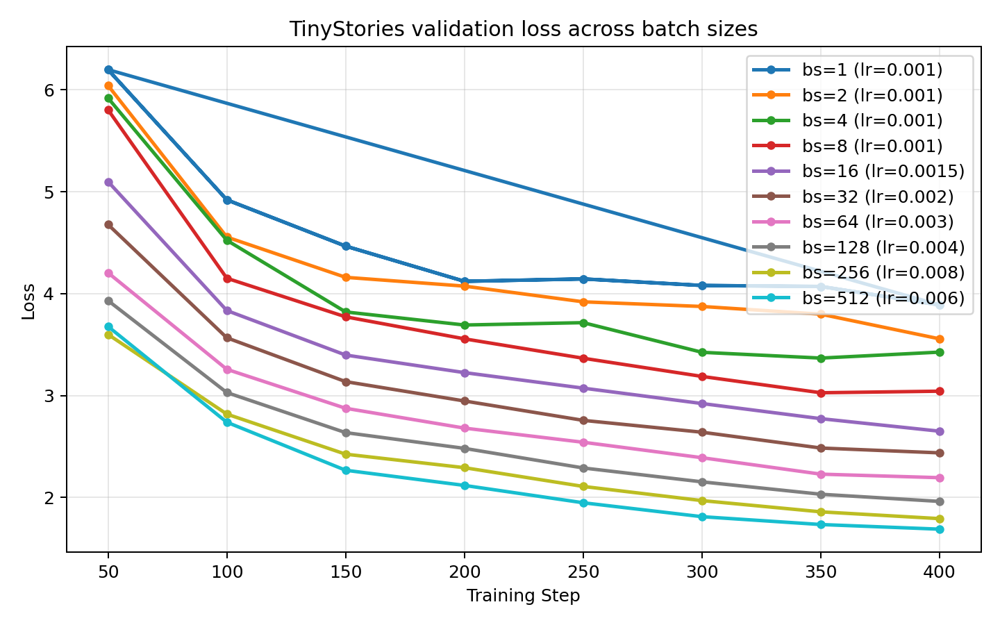
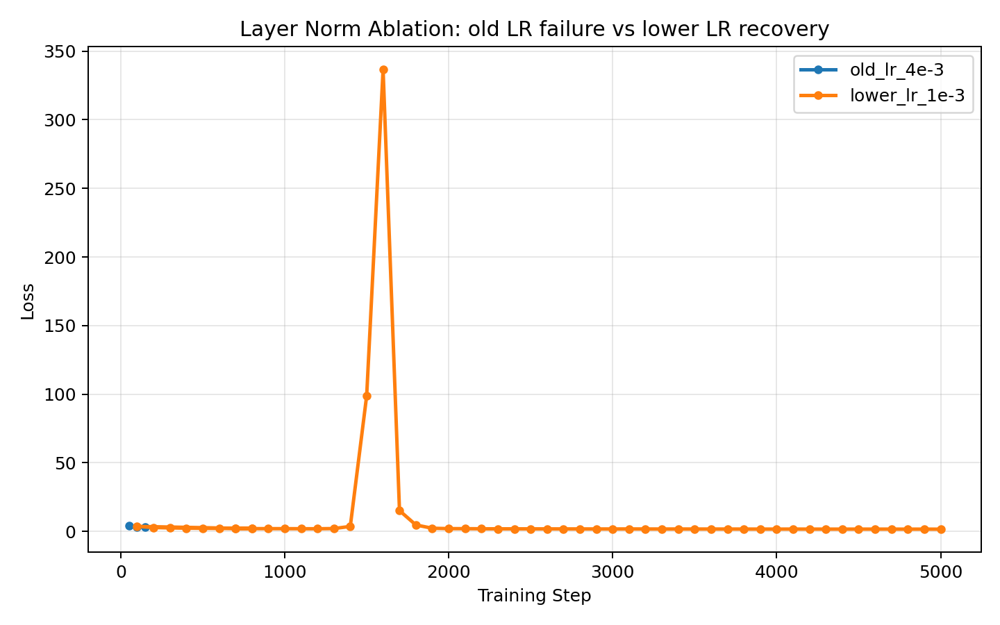
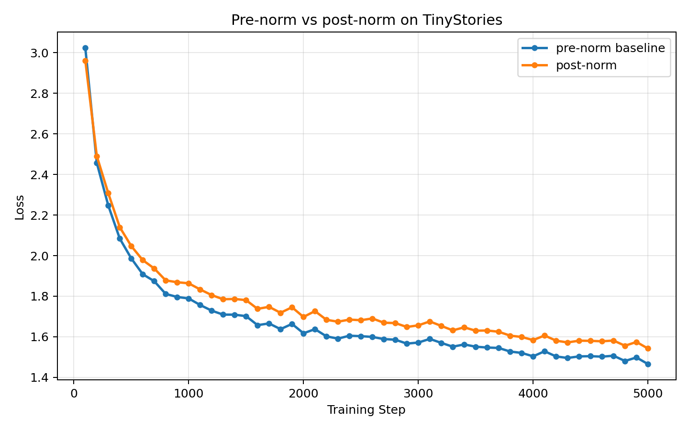
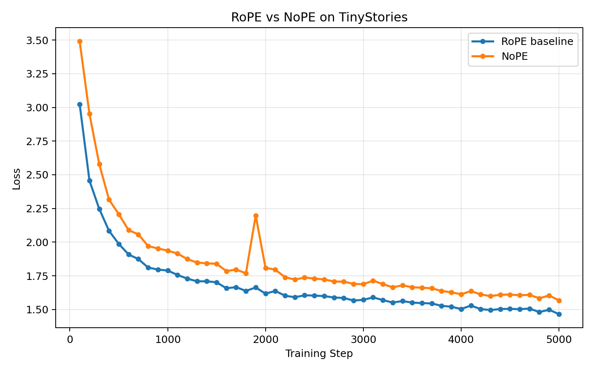
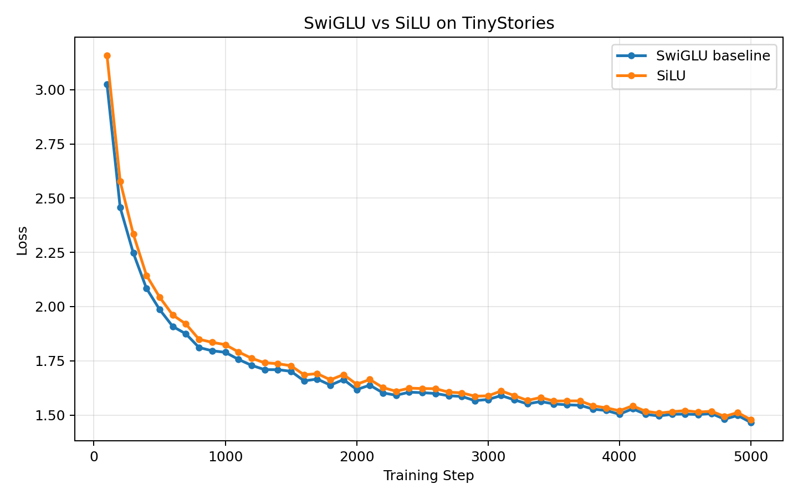
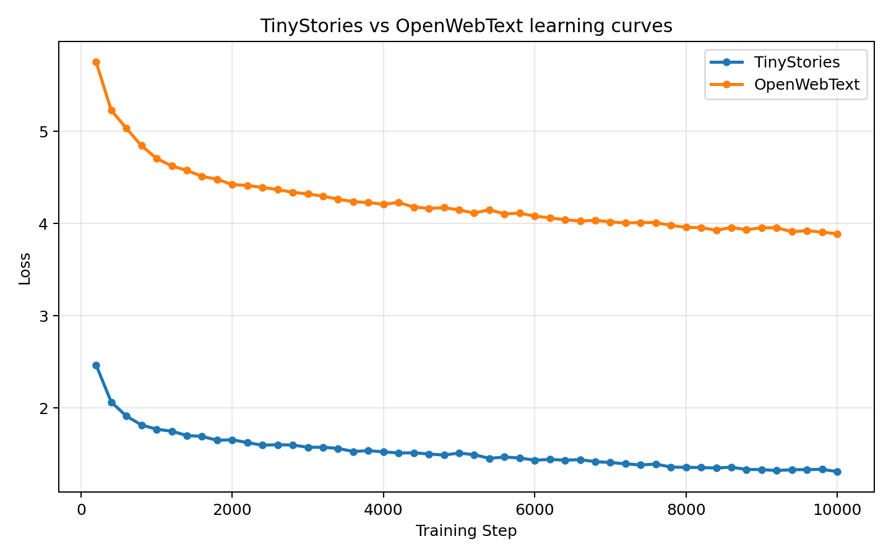
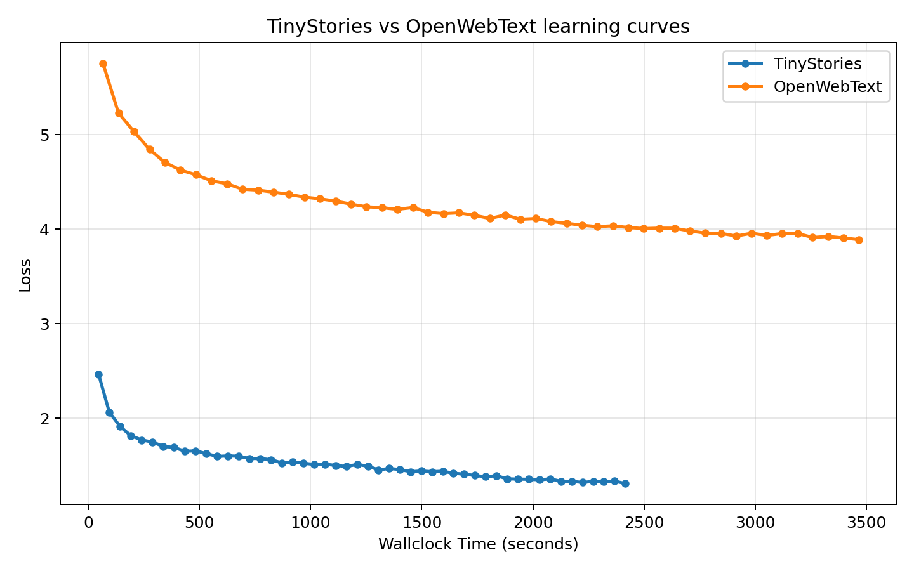

## Problem `unicode1`: Understanding Unicode (1 point)

### (a)
**Question:** What Unicode character does `chr(0)` return?  
**Deliverable:** A one-sentence response.

**Answer:** `chr(0)` returns the null character (Unicode code point U+0000, often written as `'\x00'`).

### (b)
**Question:** How does this character’s string representation (`__repr__()`) differ from its printed representation?  
**Deliverable:** A one-sentence response.

**Answer:** Its string representation is the escaped form (e.g., `'\x00'`), while printing it outputs an invisible control character.

### (c)
**Question:** What happens when this character occurs in text? It may be helpful to play around with the following in your Python interpreter and see if it matches your expectations: `chr(0)`, `print(chr(0))`, `"this is a test" + chr(0) + "string"`, and `print("this is a test" + chr(0) + "string")`.  
**Deliverable:** A one-sentence response.

**Answer:** When this character appears in text, it is invisible to readers and can cause issues in systems that treat null bytes as terminators or control characters.

---

## Problem `unicode2`: Unicode Encodings (3 points)

### (a)
**Question:** What are some reasons to prefer training our tokenizer on UTF-8 encoded bytes, rather than UTF-16 or UTF-32? It may be helpful to compare the output of these encodings for various input strings.  
**Deliverable:** A one-to-two sentence response.

**Answer:** UTF-8 is already widely used across modern systems, operating systems, and applications, so training on UTF-8 data usually leads to fewer compatibility issues in real pipelines. Compared with UTF-16 or UTF-32, UTF-8 also tends to be a more practical compression tradeoff for mixed-language text (for example, many English characters use one byte while many Chinese characters use three bytes), which is often more suitable for tokenizer and model training.

### (b)
**Question:** Consider the following (incorrect) function, which is intended to decode a UTF-8 byte string into a Unicode string. Why is this function incorrect? Provide an example of an input byte string that yields incorrect results.

```python
def decode_utf8_bytes_to_str_wrong(bytestring):
    return "".join([bytes([b]).decode("utf-8") for b in bytestring])
```

**Deliverable:** An example input byte string for which `decode_utf8_bytes_to_str_wrong` produces incorrect output, with a one-sentence explanation of why the function is incorrect.

**Answer (example bytes):** `b'\xe6\xb1\x89'`  
**Answer (explanation):** This function is incorrect because it decodes UTF-8 one byte at a time; for multi-byte characters such as `汉` (`b'\xe6\xb1\x89'`), the bytes must be decoded together, otherwise it raises a `UnicodeDecodeError` or produces incorrect decoding behavior.

### (c)
**Question:** Give a two byte sequence that does not decode to any Unicode character(s).  
**Deliverable:** An example, with a one-sentence explanation.

**Answer (example bytes):** `b'\xff\xff'`  
**Answer (explanation):** This is invalid in UTF-8 because `0xFF` is not allowed as a valid UTF-8 byte in any position.

---

## Problem `train_bpe_tinystories`: BPE Training on TinyStories (2 points)

### (a)
**Question:** Train a byte-level BPE tokenizer on the TinyStories dataset, using a maximum vocabulary size of 10,000. Make sure to add the TinyStories `<|endoftext|>` special token to the vocabulary. Serialize the resulting vocabulary and merges to disk for further inspection. How many hours and memory did training take? What is the longest token in the vocabulary? Does it make sense?  
**Deliverable:** A one-to-two sentence response.

**Answer:**
Training a 10,000-vocabulary byte-level BPE tokenizer on the full TinyStories training set (with `<|endoftext|>` included as a special token) took about 37.65 seconds (about 0.0105 hours), with peak main-process RSS around 0.233 GB. The longest token was `" responsibility"` (15 bytes), which is plausible because BPE tends to merge frequent whitespace-prefixed word pieces.

### (b)
**Question:** Profile your code. What part of the tokenizer training process takes the most time?  
**Deliverable:** A one-to-two sentence response.

**Answer:**
Profiling shows that after pre-tokenization parallelization, the dominant cost shifts to the merge stage, especially best-pair selection and heap-based pair-count maintenance (e.g., `pop_best_pair_lazy` and `_heapq.heappop`-related paths). In other words, regex pre-tokenization is no longer the primary bottleneck in the optimized implementation.

**Evidence paths (profiles/logs):**
- `artifacts/experiments/ch2/2_5_1/report.json`
- `artifacts/experiments/ch2/2_5_1/train.prof`
- `artifacts/experiments/ch2/2_5_1/README.md`

---

## Problem `train_bpe_expts_owt`: BPE Training on OpenWebText (2 points)

### (a)
**Question:** Train a byte-level BPE tokenizer on the OpenWebText dataset, using a maximum vocabulary size of 32,000. Serialize the resulting vocabulary and merges to disk for further inspection. What is the longest token in the vocabulary? Does it make sense?  
**Deliverable:** A one-to-two sentence response.

**Answer:**
Training the 32,000-vocabulary byte-level BPE tokenizer on OpenWebText completed in about 19,509.0 seconds (about 5.42 hours), and the longest token is a 64-byte run of hyphens (`"----------------------------------------------------------------"`). This is reasonable for web text, where repeated punctuation sequences are common and can become frequent merge targets.

### (b)
**Question:** Compare and contrast the tokenizer that you get training on TinyStories versus OpenWebText.  
**Deliverable:** A one-to-two sentence response.

**Answer:**
The TinyStories tokenizer (10K vocab) is more concentrated on simple narrative English (its longest token is `" responsibility"` at 15 bytes), while the OpenWebText tokenizer (32K vocab) captures a much broader and noisier web distribution, including long punctuation-heavy tokens. In practice, the OWT tokenizer should generally compress OWT-like text better, while the TinyStories tokenizer is more specialized to children-story style text.

**Evidence paths (artifacts/logs):**
- `artifacts/experiments/ch2/2_5_1/report.json`
- `artifacts/experiments/ch2/2_5_2/report.json`
- `artifacts/experiments/ch2/2_5_2/README.md`

---

## Problem `tokenizer_experiments`: Experiments with tokenizers (4 points)

### (a)
**Question:** Sample 10 documents from TinyStories and OpenWebText. Using your previously-trained TinyStories and OpenWebText tokenizers (10K and 32K vocabulary size, respectively), encode these sampled documents into integer IDs. What is each tokenizer’s compression ratio (bytes/token)?  
**Deliverable:** A one-to-two sentence response.

**Answer:**
On the 10-document samples, the TinyStories tokenizer (10K) achieves 4.0112 bytes/token on the TinyStories sample and 3.4046 bytes/token on the OpenWebText sample. The OpenWebText tokenizer (32K) achieves 4.5050 bytes/token on the OpenWebText sample and 3.8672 bytes/token on the TinyStories sample.

### (b)
**Question:** What happens if you tokenize your OpenWebText sample with the TinyStories tokenizer? Compare the compression ratio and/or qualitatively describe what happens.  
**Deliverable:** A one-to-two sentence response.

**Answer:**
When tokenizing OpenWebText with the TinyStories tokenizer, compression drops from 4.5050 to 3.4046 bytes/token (OpenWebText tokenizer vs. TinyStories tokenizer on the same OWT sample), and token count increases from 11,201 to 14,821 for the same 50,460 bytes. This indicates stronger segmentation/fragmentation under domain mismatch: the smaller, story-domain tokenizer has fewer useful merges for noisier web text patterns.

### (c)
**Question:** Estimate the throughput of your tokenizer (e.g., in bytes/second). How long would it take to tokenize the Pile dataset (825GB of text)?  
**Deliverable:** A one-to-two sentence response.

**Answer:**
Using the OpenWebText tokenizer (32K) on a 50MB OpenWebText validation slice, measured throughput is about 3,787,835 bytes/second (about 867,689 tokens/second). Extrapolating linearly to 825GB gives an estimated tokenization time of about 217,802 seconds, or 60.5 hours.

### (d)
**Question:** Using your TinyStories and OpenWebText tokenizers, encode the respective training and development datasets into a sequence of integer token IDs. We'll use this later to train our language model. We recommend serializing the token IDs as a NumPy array of datatype `uint16`. Why is `uint16` an appropriate choice?  

**Answer:**
`uint16` is appropriate because both tokenizer vocabularies are far below 65,536 entries (TinyStories: 10,000; OpenWebText: 32,000), so every valid token ID fits safely in 16 bits. This cuts storage roughly in half versus `int32` while still preserving exact token IDs, and our encoding pipeline explicitly checks for overflow before casting to `uint16`, so successful corpus encoding confirms the dtype is valid for these tokenizers.

---

## Problem `transformer_accounting`: Transformer LM resource accounting (5 points)

### (a)
**Question:** Consider GPT-2 XL, which has the following configuration: `vocab_size=50,257`, `context_length=1,024`, `num_layers=48`, `d_model=1,600`, `num_heads=25`, and `d_ff=6,400`. Suppose we constructed our model using this configuration. How many trainable parameters would our model have? Assuming each parameter is represented using single-precision floating point, how much memory is required to just load this model?  
**Deliverable:** A one-to-two sentence response.

**Answer:**
Let `V = vocab_size`, `T = context_length`, `L = num_layers`, `D = d_model`, `H = num_heads`, and `F = d_ff`.
For this assignment's `TransformerLM` implementation, the parameter count is

$$
\text{token embeddings} + \text{num layers} \cdot (\text{attention} + \text{FFN} + \text{RMSNorm}) + \text{final norm} + \text{LM head}
$$

where

$$
\text{token embeddings} = V D \\
\text{attention} = 4 D^2 \\
\text{FFN} = 3 D F \\
\text{RMSNorm} = 2 D
$$

per block. Plugging in `V = 50,257`, `L = 48`, `D = 1600`, and `F = 6400` gives

$$
2VD + L(4D^2 + 3DF + 2D) + D \\
= 2 \cdot 50257 \cdot 1600 + 48(4 \cdot 1600^2 + 3 \cdot 1600 \cdot 6400 + 2 \cdot 1600) + 1600 \\
= 2{,}127{,}057{,}600
$$

So the model has `2,127,057,600` trainable parameters (about `2.13B`); at float32 (`4` bytes per parameter), this requires

$$
2{,}127{,}057{,}600 \cdot 4 = 8{,}508{,}230{,}400
$$

bytes, or about `8.51 GB` (`7.92 GiB`), just to store the parameters.
These values are checked by `artifacts/experiments/ch3/3_6_1/verify_gpt2_xl_accounting.py`.

### (b)
**Question:** Identify the matrix multiplies required to complete a forward pass of our GPT-2 XL-shaped model. How many FLOPs do these matrix multiplies require in total? Assume that our input sequence has `context_length` tokens.  
**Deliverable:** A list of matrix multiplies (with descriptions), and the total number of FLOPs required.

**Answer:**
Let `V = vocab_size`, `T = context_length`, `L = num_layers`, `D = d_model`, `H = num_heads`, and `F = d_ff`, with `d_k = D / H`.
Using the handout rule that a matrix multiply `(m x n) @ (n x p)` costs `2mnp` FLOPs, the forward-pass cost is

$$
L(8TD^2 + 4T^2D + 6TDF) + 2TDV
$$

where $8TD^2$ comes from the four attention projections, $4T^2D$ comes from $QK^T$ and $A @ V$, $6TDF$ comes from the three FFN multiplies, and $2TDV$ comes from the final LM head.
Assuming a single input sequence of length `T = 1024`, with `L = 48`, `D = 1600`, `H = 25`, `d_k = D / H = 64`, `F = 6400`, and `V = 50257`, the matrix multiplies in one forward pass are:

- Per layer attention projections:
  - `X @ W_Q`: `2 * T * D * D = 2 * 1024 * 1600 * 1600 = 5,242,880,000`
  - `X @ W_K`: `5,242,880,000`
  - `X @ W_V`: `5,242,880,000`
  - `concat(heads) @ W_O`: `5,242,880,000`
- Per layer attention score/value products:
  - `Q @ K^T`: `2 * H * T * d_k * T = 2 * 25 * 1024 * 64 * 1024 = 3,355,443,200`
  - `A @ V`: `3,355,443,200`
- Per layer FFN:
  - `X @ W_1`: `2 * T * D * F = 2 * 1024 * 1600 * 6400 = 20,971,520,000`
  - `X @ W_3`: `20,971,520,000`
  - `gate @ W_2`: `2 * T * F * D = 20,971,520,000`

This gives `90,596,966,400` FLOPs per Transformer layer, so the `48` blocks require `4,348,654,387,200` FLOPs in total. The final language-model head adds

$$
2TDV = 2 \cdot 1024 \cdot 1600 \cdot 50257 = 164{,}682{,}137{,}600
$$

FLOPs, giving a total of `4,513,336,524,800` FLOPs for one forward pass. These values are checked by `artifacts/experiments/ch3/3_6_1/verify_gpt2_xl_accounting.py`.

### (c)
**Question:** Based on your analysis above, which parts of the model require the most FLOPs?  
**Deliverable:** A one-to-two sentence response.

**Answer:**
Using the component decomposition from part (b), the dominant term is the FFN block ($W_1$, $W_3$, $W_2$), which contributes about `66.9%` of the total forward-pass FLOPs. The next largest contributor is the attention projection stack ($Q/K/V/O$) at about `22.3%`, while $QK^T$, $A @ V$, and the final LM head each contribute only a few percent.

### (d)
**Question:** Repeat your analysis with GPT-2 small (12 layers, 768 `d_model`, 12 heads), GPT-2 medium (24 layers, 1024 `d_model`, 16 heads), and GPT-2 large (36 layers, 1280 `d_model`, 20 heads). As the model size increases, which parts of the Transformer LM take up proportionally more or less of the total FLOPs?  
**Deliverable:** For each model, provide a breakdown of model components and its associated FLOPs (as a proportion of the total FLOPs required for a forward pass). In addition, provide a one-to-two sentence description of how varying the model size changes the proportional FLOPs of each component.

**Answer:**
Using the same notation as above, with `V = vocab_size`, `T = context_length`, `L = num_layers`, `D = d_model`, `H = num_heads`, and `F = d_ff`, the total forward-pass FLOPs are

$$
\text{total} = L(8TD^2 + 4T^2D + 6TDF) + 2TDV
$$

Using this formula,
I break the total into five components: attention projections, attention scores ($QK^T$), attention values ($A @ V$), FFN, and the LM head. The forward-pass FLOP breakdowns are:

- **GPT-2 small**
  - attention projections: `57,982,058,496` FLOPs (`16.58%`)
  - attention scores ($QK^T$): `19,327,352,832` FLOPs (`5.53%`)
  - attention values ($A @ V$): `19,327,352,832` FLOPs (`5.53%`)
  - FFN: `173,946,175,488` FLOPs (`49.75%`)
  - `lm_head`: `79,047,426,048` FLOPs (`22.61%`)

- **GPT-2 medium**
  - attention projections: `206,158,430,208` FLOPs (`19.96%`)
  - attention scores ($QK^T$): `51,539,607,552` FLOPs (`4.99%`)
  - attention values ($A @ V$): `51,539,607,552` FLOPs (`4.99%`)
  - FFN: `618,475,290,624` FLOPs (`59.87%`)
  - `lm_head`: `105,396,568,064` FLOPs (`10.20%`)

- **GPT-2 large**
  - attention projections: `483,183,820,800` FLOPs (`21.40%`)
  - attention scores ($QK^T$): `96,636,764,160` FLOPs (`4.28%`)
  - attention values ($A @ V$): `96,636,764,160` FLOPs (`4.28%`)
  - FFN: `1,449,551,462,400` FLOPs (`64.20%`)
  - `lm_head`: `131,745,710,080` FLOPs (`5.84%`)

At fixed context length, increasing model size makes the $O(T d_{model}^2)$ terms more dominant, especially the FFN and attention projection layers. In contrast, the $O(T^2 d_{model})$ attention matrix products and the final LM head take up a smaller fraction of total FLOPs as `d_model` and `num_layers` grow.

### (e)
**Question:** Take GPT-2 XL and increase the context length to 16,384. How does the total FLOPs for one forward pass change? How do the relative contribution of FLOPs of the model components change?  
**Deliverable:** A one-to-two sentence response.

**Answer:**
Under the same formula, increasing context length mainly changes the balance between the $O(TD^2)$ terms and the $O(T^2D)$ attention-matrix terms. For GPT-2 XL,

$$
T: 1024 \rightarrow 16{,}384 \\
\text{total FLOPs}: 4{,}513{,}336{,}524{,}800 \rightarrow 149{,}522{,}795{,}724{,}800
$$

(about `33.1x`), and the combined share of $QK^T$ plus $A @ V$ grows from about `7.14%` to about `55.15%`, making long-context attention much more dominant.

---

## Problem `learning_rate_tuning`: Tuning the learning rate (1 point)

**Question:** Run the SGD example above with three other values for the learning rate: `1e1`, `1e2`, and `1e3`, for just 10 training iterations. What happens with the loss for each of these learning rates? Does it decay faster, slower, or does it diverge (i.e., increase over the course of training)?  
**Deliverable:** A one-two sentence response with the behaviors you observed.

**Answer:**  
With a learning rate of `1e1`, the loss decreases steadily but more slowly than with `1e2`. A learning rate of `1e2` reduces the loss faster, while `1e3` causes the optimization to diverge rather than converge.

---

## Problem `adamwAccounting`: Resource accounting for training with AdamW (2 points)

### (a)
**Question:** How much peak memory does running AdamW require? Decompose your answer based on the memory usage of the parameters, activations, gradients, and optimizer state. Express your answer in terms of the `batch_size` and the model hyperparameters (`vocab_size`, `context_length`, `num_layers`, `d_model`, `num_heads`). Assume `d_ff = 4 * d_model`.  
**Deliverable:** An algebraic expression for each of parameters, activations, gradients, and optimizer state, as well as the total.

**Answer:**  
Let `B = batch_size`, `V = vocab_size`, `T = context_length`, `L = num_layers`, `D = d_model`, `H = num_heads`, and `d_ff = 4D`. Since all tensors are in float32, each stored element uses `4` bytes.

The total number of model parameters is

$$
P = 2VD + L(16D^2 + 2D) + D
$$

where `2VD` comes from the input embedding and output projection, each Transformer block contributes `4D^2` attention parameters, `12D^2` SwiGLU parameters, and `2D` RMSNorm parameters, and the final RMSNorm contributes `D`.

Therefore, parameter memory is

$$
M_{\text{params}} = 4P = 4[2VD + L(16D^2 + 2D) + D].
$$

Gradient memory matches parameter memory because each parameter has a float32 gradient tensor of the same shape:

$$
M_{\text{grads}} = 4P = 4[2VD + L(16D^2 + 2D) + D].
$$

For AdamW, the optimizer state stores two float32 tensors per parameter, the first and second moments (`m` and `v`), so

$$
M_{\text{opt}} = 8P = 8[2VD + L(16D^2 + 2D) + D].
$$

For activations, counting only the intermediates explicitly listed in the handout:

- per Transformer block:
  - two RMSNorm outputs: `2BTD`
  - attention sublayer:
    - `Q`, `K`, `V` projections: `3BTD`
    - `QK^T`: `BHT^2`
    - softmax output: `BHT^2`
    - weighted sum of values: `BTD`
    - output projection: `BTD`
  - position-wise feed-forward:
    - `W_1` output: `4BTD`
    - SiLU output: `4BTD`
    - `W_2` output: `BTD`

So each block contributes

$$
16BTD + 2BHT^2
$$

activation elements. Adding the final RMSNorm output (`BTD`), output embedding / logits (`BTV`), and cross-entropy on logits (`BTV`) gives

$$
M_{\text{acts}} = 4[L(16BTD + 2BHT^2) + BTD + 2BTV].
$$

The total peak memory is therefore

$$
M_{\text{total}} = M_{\text{params}} + M_{\text{acts}} + M_{\text{grads}} + M_{\text{opt}} \\
= 16[2VD + L(16D^2 + 2D) + D] + 4[L(16BTD + 2BHT^2) + BTD + 2BTV]
$$

### (b)
**Question:** Instantiate your answer for a GPT-2 XL-shaped model to get an expression that only depends on the `batch_size`. What is the maximum batch size you can use and still fit within 80GB memory?  
**Deliverable:** An expression that looks like `a * batch_size + b` for numerical values `a`, `b`, and a number representing the maximum batch size.

**Answer:**  
For GPT-2 XL, using `V = 50,257`, `T = 1,024`, `L = 48`, `D = 1,600`, and `H = 25`, the total memory expression from part `(a)` becomes

$$
M_{\text{total}}(B) = 15{,}517{,}753{,}344 \cdot B + 34{,}032{,}921{,}600
$$

bytes,

where the linear term comes from activations and the constant term comes from parameters, gradients, and AdamW optimizer state. If we interpret `80GB` in decimal units as `80,000,000,000` bytes, then the maximum batch size is `2`, since $B = 3$ would require `80,586,181,632` bytes. (If one instead uses the binary convention $80\ \mathrm{GiB} = 80 \cdot 1024^3$ bytes, the answer would be `3`, but I use the decimal `80GB` wording from the prompt here.)

### (c)
**Question:** How many FLOPs does running one step of AdamW take?  
**Deliverable:** An algebraic expression, with a brief justification.

**Answer:**  
Let `B = batch_size`, `V = vocab_size`, `T = context_length`, `L = num_layers`, `D = d_model`, `H = num_heads`, and `d_ff = 4D`. Reusing the matrix-multiply accounting from `transformer_accounting`, the forward-pass FLOPs for a batch are

$$
F_{\text{forward}} = L(32BTD^2 + 4BT^2D) + 2BTDV.
$$

Using the standard approximation that the backward pass costs twice the forward pass, we have

$$
F_{\text{backward}} \approx 2F_{\text{forward}}.
$$

For the AdamW optimizer update itself, treating elementwise arithmetic as constant-cost operations, each parameter contributes a constant number of FLOPs for updating the first moment `m`, second moment `v`, the Adam parameter update, and the decoupled weight decay update. Concretely, for each parameter element:

- first-moment update
  `m <- beta_1 m + (1 - beta_1) g`
  costs about `3` FLOPs (`2` multiplies and `1` addition),
- second-moment update
  `v <- beta_2 v + (1 - beta_2) g^2`
  costs about `4` FLOPs (`1` multiply for `g^2`, `2` more multiplies, and `1` addition),
- Adam parameter update
  `theta <- theta - alpha_t m / (sqrt(v) + eps)`
  costs about `5` FLOPs (`sqrt`, add `eps`, divide, multiply, subtract),
- decoupled weight decay
  `theta <- theta - alpha lambda theta`
  costs about `3` FLOPs (`2` multiplies and `1` subtraction).

This gives about $3 + 4 + 5 + 3 = 15$ FLOPs per parameter element, so a convenient accounting is

$$
F_{\text{opt}} \approx 15P
$$

where

$$
P = 2VD + L(16D^2 + 2D) + D
$$

is the total number of parameters. Therefore, one AdamW training step requires approximately

$$
F_{\text{step}} \approx F_{\text{forward}} + F_{\text{backward}} + F_{\text{opt}} = 3F_{\text{forward}} + 15P \\
= 3[L(32BTD^2 + 4BT^2D) + 2BTDV] + 15[2VD + L(16D^2 + 2D) + D]
$$

The dominant term is the forward/backward model computation; the optimizer update is lower-order in practice because it is only linear in the parameter count.

### (d)
**Question:** Model FLOPs utilization (MFU) is defined as the ratio of observed throughput (tokens per second) relative to the hardware's theoretical peak FLOP throughput. An NVIDIA A100 GPU has a theoretical peak of 19.5 teraFLOP/s for float32 operations. Assuming you are able to get 50% MFU, how long would it take to train a GPT-2 XL for 400K steps and a batch size of 1024 on a single A100? Following Kaplan et al. and Hoffmann et al., assume that the backward pass has twice the FLOPs of the forward pass.  
**Deliverable:** The number of days training would take, with a brief justification.

**Answer:**  
Using the forward-pass result from `transformer_accounting`, GPT-2 XL requires `4,513,336,524,800` FLOPs per sequence of length `1024`. With batch size `1024`, this gives `4,621,656,601,395,200` forward FLOPs per training step. Using the approximation $backward = 2 \times forward$, plus the AdamW optimizer cost $F_{opt} = 15P = 31{,}905{,}864{,}000$, one step costs approximately

$$
13{,}865{,}001{,}710{,}049{,}600
$$

FLOPs in total. Over `400,000` steps this is

$$
5.54600068401984 \times 10^{21}
$$

FLOPs, and at `50%` MFU on a single A100 the effective throughput is

$$
0.5 \cdot 19.5 \times 10^{12} = 9.75 \times 10^{12}
$$

FLOP/s, so training would take about `6,583.6` days (about `18.0` years). This is a hypothetical throughput estimate and does not require the batch size to satisfy the separate memory constraint from part `(b)`.

---

## Problem `learning_rate`: Tune the learning rate (3 points)

### (a)
**Question:** Perform a hyperparameter sweep over the learning rates and report the final losses (or note divergence if the optimizer diverges).  
**Deliverable:** Learning curves associated with multiple learning rates. Explain your hyperparameter search strategy.  
**Deliverable:** A model with validation loss (per-token) on TinyStories of at most 1.45.

**Answer:**

I reran the learning-rate search on the TinyStories baseline model using `batch_size=128`, since this batch size is a better fit for my hardware. The model configuration was otherwise unchanged (`vocab_size=10000`, `context_length=256`, `d_model=512`, `d_ff=1344`, `num_layers=4`, `num_heads=16`, `rope_theta=10000`). I used a two-stage search strategy: a broad 60-step pilot sweep to bracket the good region and the failure-side region, followed by a refined sweep around the local optimum.

The coarse sweep showed that the best region was near a few times `10^-3`, while much larger learning rates quickly degraded. In the refined sweep, the best learning rate was `4.0e-3`, with best validation loss `3.5015` at step `60`. Nearby values were all slightly worse (`2.5e-3 -> 3.5286`, `3.5e-3 -> 3.5669`, `4.5e-3 -> 3.7722`, `5.0e-3 -> 3.8112`), so the local optimum was clearly centered near `4e-3`.

I then used `learning_rate=4.0e-3` for a longer training run with `warmup_iters=200`, `beta1=0.9`, `beta2=0.999`, `eps=1e-8`, and `weight_decay=0.1`. With `batch_size=128` and `10000` steps, this run processed exactly `327,680,000` tokens and reached best validation loss `1.3234` at step `10000`, comfortably beating the assignment target of `1.45`. This is therefore the final learning rate I selected for the TinyStories model under the `batch_size=128` setting.


Figure: TinyStories validation-loss curves at `batch_size=128` for representative learning rates. The best region is centered near `4e-3`, while larger learning rates quickly degrade.

### (b)
**Question:** Folk wisdom is that the best learning rate is "at the edge of stability." Investigate how the point at which learning rates diverge is related to your best learning rate.

**Deliverable:** Learning curves of increasing learning rate which include at least one divergent run and an analysis of how this relates to convergence rates.

**Answer:**

The `batch_size=128` rerun suggests that the best learning rate is not exactly at the literal NaN boundary. The refined optimum was `4.0e-3`, but a range of larger values (`1.2e-2`, `2e-2`, `5e-2`) still trained for 60 steps without numerical blow-up while giving clearly worse validation loss. In other words, there is a substantial "stable but degraded" region above the optimum.

At still larger learning rates, the runs entered a genuinely divergent optimization regime. In the same pilot setup, `1e-1` reached validation loss `5.4419`, `2e-1` reached `5.9544`, and `5e-1` reached `22.5846`; the highest-LR curve blows up rapidly and no longer makes meaningful optimization progress. Although these short pilots did not hit `NaN` within 60 steps, I still count the largest-LR runs as divergent in the optimization sense because the loss sharply departs from the stable training region and does not recover. So in this experiment the best learning rate is better described as lying below a broad degraded region and well below the clearly divergent high-LR regime, rather than exactly at the first point of numerical overflow.


Figure: At `batch_size=128`, learning rates above the optimum quickly move from "worse but stable" into an unusable failure-side regime.

---

## Problem `batch_size_experiment`: Batch size variations (1 point)

**Question:** Vary your batch size all the way from 1 to the GPU memory limit. Try at least a few batch sizes in between, including typical sizes like 64 and 128.  
**Deliverable:** Learning curves for runs with different batch sizes. The learning rates should be optimized again if necessary.  
**Deliverable:** A few sentences discussing of your findings on batch sizes and their impacts on training.

**Answer:**

I varied batch size from `1` up to the largest configuration that completed cleanly in my sweep (`512`) and re-tuned the learning rate locally for each batch size using short 400-step pilots with the same model architecture and optimizer settings. The best learning rates increased monotonically with batch size: `1.0e-3` for `bs=1/2/4/8`, `1.5e-3` for `bs=16`, `2.0e-3` for `bs=32`, `3.0e-3` for `bs=64`, `4.0e-3` for `bs=128`, `8.0e-3` for `bs=256`, and `6.0e-3` for `bs=512`.

At a fixed 400-step pilot budget, validation loss improved steadily as batch size increased. The best validation losses were `2.194` at `bs=64`, `1.961` at `bs=128`, `1.792` at `bs=256`, and `1.689` at `bs=512`. However, step time also increased substantially: about `0.257s/step` at `bs=128`, `0.495s/step` at `bs=256`, and `0.980s/step` at `bs=512`. In practice, `bs=128` is a good speed-oriented default, while `bs=256` is the best overall quality/throughput compromise on my hardware. `bs=512` gave the lowest pilot validation loss among the completed runs, but its per-step cost was much higher, so the marginal quality gain came with a large runtime penalty.



Figure: Best validation-loss curve for each batch size after local LR retuning. Larger batch sizes achieve lower loss in the fixed-step pilot, but the runtime cost grows sharply beyond `bs=256`.

---

## Problem `generate`: Generate text (1 point)

**Question:** Using your decoder and your trained checkpoint, report the text generated by your model. You may need to manipulate decoder parameters (temperature, top-p, etc.) to get fluent outputs.

**Deliverable:** Text dump of at least 256 tokens of text (or until the first `<|endoftext|>` token), and a brief comment on the fluency of this output and at least two factors which affect how good or bad this output is.

**Generated text:**

```text
Once upon a time, there was a happy little girl named Mia. She loved to play with her toys and make new friends. One day, she found a small green mint in her toy box. Mia thought it would be fun to hide the mint in her toy box.
Mia put the mint in a special box and hid it under her bed. She wanted her friends to find the mint when she went to play outside. She thought, "I will play a game with my friends, and they will find the mint."
The next day, Mia went to the park with her mom. They saw a big, round, and shiny thing in the grass. Mia picked it up and showed it to her friends. They all thought it was a new toy and wanted to play with it.
Mia took the mint and showed it to her friends. They all looked at it and thought it was very pretty. Mia decided to keep the mint in her toy box and show it to her friends. They all thought it was very special and loved it too. From that day on, Mia and her friends always played with the magic mint and had lots of fun together.
<|endoftext|>
```

**Commentary:**

The sample is fluent and clearly matches the TinyStories style: it uses simple vocabulary, short sentences, and a coherent narrative arc with a beginning, development, and ending. The story stays on-topic, keeps the same protagonist throughout, and ends cleanly with `<|endoftext|>`, which is what I wanted from a small in-domain language model.

Two main factors affect the output quality here. First, checkpoint quality matters directly: this sample came from the final `batch_size=128`, `learning_rate=4e-3` TinyStories model, which reached validation loss `1.323`, so the model had already learned the dataset's short-story structure well. Second, decoding hyperparameters matter: I used nucleus sampling with `temperature=0.8` and `top_p=0.9`, which gave a good balance between diversity and stability. Lower temperature would likely make the output more repetitive, while higher temperature would make it less coherent. A third factor is the simplicity of the TinyStories domain itself: because the dataset contains short, formulaic children's stories, even a relatively small model can sound quite fluent in-domain.

---

## Problem `layer_norm_ablation`: Remove RMSNorm and train (1 point)

**Question:** Remove all of the RMSNorms from your Transformer and train. What happens at the previous optimal learning rate? Can you get stability by using a lower learning rate?  
**Deliverable:** A learning curve for when you remove RMSNorms and train, as well as a learning curve for the best learning rate.  
**Deliverable:** A few sentence commentary on the impact of RMSNorm.

**Answer:**

I removed all RMSNorm layers from the writeup-facing TinyStories baseline, including the final RMSNorm before the LM head, and first retrained using the previous best hyperparameters from the current writeup configuration: `batch_size=128`, `learning_rate=4.0e-3`, `warmup_iters=200`, `beta1=0.9`, `beta2=0.999`, `eps=1e-8`, and `weight_decay=0.1`. Early training still made progress, with validation loss decreasing from `4.0035` at step `50` to `2.8888` at step `150`, but the run became numerically unstable shortly afterward. At step `200`, when the warmup schedule had raised the learning rate to about `3.98e-3`, both train and validation loss became `NaN`, and all later diagnostics (`grad_norm_pre_clip`, `grad_norm_post_clip`, and `param_norm`) also stayed `NaN`.

I then searched over lower learning rates with the same no-RMSNorm architecture and found that `learning_rate=1.0e-3` was the best stable point in my coarse sweep over `{1.0e-3, 1.5e-3, 2.0e-3, 2.5e-3, 3.0e-3}`. In that sweep, `1.5e-3` eventually diverged as well, while `2.0e-3` and above already deteriorated much earlier. Using `learning_rate=1.0e-3`, I ran a longer `5000`-step confirmation experiment. This run remained numerically stable throughout, processed `163,840,000` tokens, and reached best validation loss `1.5492` at step `5000`.

These results show that RMSNorm is doing important stabilization work in the baseline model. The previous optimal learning rate is too high once normalization is removed: training does not merely degrade, it becomes numerically unstable during warmup. Lowering the learning rate to `1.0e-3` restores stable optimization, but performance is still substantially worse than the normalized baseline, whose tuned `batch_size=128`, `learning_rate=4e-3` run reached validation loss `1.3234`. In short, RMSNorm improves both optimization stability and quality under a fixed training budget.



Figure: Without RMSNorm, the previous optimal `learning_rate=4e-3` becomes unstable and reaches `NaN`, while lowering the learning rate to `1e-3` restores stable training. Even after stabilization, the no-RMSNorm model converges much worse than the normalized baseline.

---

## Problem `pre_norm_ablation`: Implement post-norm and train (1 point)

**Question:** Modify your pre-norm Transformer implementation into a post-norm one. Train with the post-norm model and see what happens.  
**Deliverable:** A learning curve for a post-norm transformer, compared to the pre-norm one.

**Answer:**

Starting from the same fixed TinyStories training setup used in the other architecture ablations (`batch_size=128`, `learning_rate=4e-3`, `warmup_iters=200`, `cosine_cycle_iters=10000`, `max_steps=5000`), I replaced the standard pre-norm Transformer blocks with post-norm ones and kept all other settings unchanged. Both the matched-horizon pre-norm baseline and the post-norm model trained stably for the full `5000` steps, so unlike the no-RMSNorm ablation, this change did not cause numerical failure under the baseline optimizer settings.

However, post-norm converged noticeably worse than pre-norm. The matched-horizon pre-norm control reached validation loss `1.4656` at step `5000`, while the post-norm run only reached `1.5422` at the same step, a degradation of about `0.0766` validation-loss points. This indicates that even when post-norm remains trainable, pre-norm is still the better optimization choice for this model and budget: it gives consistently faster and better convergence.



Figure: Under the same TinyStories training hyperparameters, pre-norm converges better than post-norm over `5000` steps.

---

## Problem `no_pos_emb`: Implement NoPE (1 point)

**Question:** Modify your Transformer implementation with RoPE to remove the position embedding information entirely, and see what happens.  
**Deliverable:** A learning curve comparing the performance of RoPE and NoPE.

**Answer:**

I next removed RoPE entirely and trained the resulting NoPE model with the same fixed hyperparameters as the matched-horizon baseline. The model remained trainable and continued improving throughout the `5000`-step run, which is consistent with the idea that a causal decoder can infer some positional structure even without explicit positional embeddings.

Even so, removing positional information clearly hurt performance. The RoPE baseline reached validation loss `1.4656` at step `5000`, whereas the NoPE model reached only `1.5676`, a gap of about `0.1020`. Among the three architecture ablations in this matched-horizon suite, NoPE was the worst. So while explicit positional embeddings are not strictly required for learning to proceed, they are still very important for good sample efficiency and final quality on this task.



Figure: Removing RoPE does not prevent learning, but the NoPE model converges substantially worse than the RoPE baseline.

---

## Problem `swiglu_ablation`: SwiGLU vs. SiLU (1 point)

**Deliverable:** A learning curve comparing the performance of SwiGLU and SiLU feed-forward networks, with approximately matched parameter counts.

**Answer:**

For this ablation I replaced SwiGLU with a plain SiLU feed-forward network, while increasing the inner feed-forward width to `d_ff = 4 * d_model = 2048` to approximately match parameter count, as requested in the handout. All optimizer and training hyperparameters were otherwise kept fixed to the same matched-horizon TinyStories baseline used above.

This change produced the smallest degradation of the three ablations. The SwiGLU baseline reached validation loss `1.4656` at step `5000`, while the SiLU model reached `1.4781`, only about `0.0125` worse. So gating does help, and SwiGLU is still the better choice, but on this model scale and budget the advantage is modest compared with the much larger effects of normalization placement or removing positional information.



Figure: SwiGLU converges slightly better than a parameter-matched SiLU feed-forward network, but the gap is much smaller than in the post-norm or NoPE ablations.

---

## Problem `main_experiment`: Experiment on OpenWebText (2 points)

### (a)
**Question:** Train your language model on OpenWebText with the same model architecture and total training iterations as TinyStories. How well does this model do?  
**Deliverable:** A learning curve of your language model on OpenWebText. Describe the difference in losses from TinyStories - how should we interpret these losses?

**Answer:**

For the OpenWebText main experiment, I kept the same Transformer stack and training horizon as in the TinyStories main run: `context_length=256`, `d_model=512`, `d_ff=1344`, `num_layers=4`, `num_heads=16`, pre-norm, RoPE, SwiGLU, `batch_size=128`, and `10000` optimizer steps. This again corresponds to exactly `327,680,000` processed tokens. Because OWT uses a different dataset and tokenizer, I re-tuned the learning rate at `batch_size=128` using a two-stage pilot sweep. A coarse sweep identified the best region near `2e-3` to `3e-3`, and a refined sweep over `{1.5e-3, 2.0e-3, 2.5e-3, 3.0e-3, 3.5e-3}` selected `learning_rate=2.5e-3`, with best pilot validation loss `5.2282` at step `400`.

Using that tuned learning rate, the final OWT run reached best validation loss `3.8886` at step `10000`. The run completed in about `3470.46` seconds (`57.8` minutes), so it stayed comfortably within the intended wall-clock budget. For comparison, the matched TinyStories rerun used for the joint learning-curve figure reached validation loss `1.3105` at the same `10000`-step horizon. The OWT model therefore trains successfully under the matched budget, but its absolute validation loss remains much higher than TinyStories.

The main reason for the loss gap is that OpenWebText is a broader and higher-entropy distribution. TinyStories is intentionally simple and repetitive: it has a small vocabulary, short sentences, recurring narrative templates, and strong local regularities. OWT is much more heterogeneous, spanning many topics, styles, and discourse structures, so the same model capacity must spread across a much harder prediction problem. In addition, the OWT tokenizer uses a larger `32K` vocabulary instead of the TinyStories `10K` vocabulary, which makes the prediction space less specialized to a narrow domain. Even so, the OWT curve still improves throughout the full run and reaches its best value at the final step, which suggests that the model was still undertrained rather than overfit at this budget.



Figure: Under the same `10000`-step training budget, the OpenWebText model converges much more slowly and to a much higher loss than the matched TinyStories run.



Figure: The OWT run also remains within the wall-clock budget, finishing in under one hour, but it is consistently worse than TinyStories at matched time as well as matched steps.

### (b)
**Deliverable:** Generated text from OpenWebText LM, in the same format as the TinyStories outputs. How is the fluency of this text? Why is the output quality worse even though we have the same model and compute budget as TinyStories?

**Answer:**

I generated from the OWT checkpoint using the same decoding settings as the TinyStories sample for a fair comparison: prompt `"Once upon a time, there was"`, `max_new_tokens=256`, `temperature=0.8`, and `top_p=0.9`.

**Generated text:**

```text
Once upon a time, there was one, one, an opportunity to become a well-known politician and a clear-eyed friend of mine. (During this time, I had to make my point.)

Once I was a member of the Council and in the Conservative Party, I understood what was going on with the ‘reactionary principle’ of the Conservatives. I thought we had to be on the side of the job in the future, in order to make an informed decision on what to do. That was how I was now in the Conservative Party, and the same history was the exact opposite of the Prime Minister’s approach in the coming weeks. The same was true for the Liberals.

Then, as a former Tory councillor, I was in the Conservative Party and I was very proud of what the campaign would have done.

One of my closest friends and colleagues I had in the last three months was a member of the Labour Party. He seemed to have been all but certain to be on the run for the party in the leadership, the party. He was a minister for Labour and the leader for the party. He was a leader in Labour and would like to see the party in the hands of the party and the leadership.

A couple of years later I attended
```

This sample is more coherent than the first noisy trial I observed during debugging, but it is still clearly worse than the TinyStories generation. The model does produce recognizable English prose and even settles into a plausible political-news/register shift, which is a reasonable match to OpenWebText. However, it still shows several quality problems: awkward opening repetition (`"one, one"`), entity/topic drift, repeated phrases around `"the party"` and `"Conservative Party"`, and an abrupt stop without reaching a clean ending or `<|endoftext|>` token within the decoding budget. So the model has learned broad stylistic fragments of web text, but it still struggles to maintain strong discourse structure over a longer continuation.

There are several reasons the output quality is worse despite using the same architecture and compute budget. First, OWT is a much harder modeling problem than TinyStories, so the same small model must spread its capacity over many more topics, genres, and writing styles. Second, the prompt itself is still more naturally in-domain for TinyStories than for OWT: a fairy-tale opening is a direct fit for the children-story corpus, but on OWT it can push the model into an unstable mixture of narrative and political/news continuation modes. Third, repetition and unfinished continuations are typical symptoms of an undertrained small model on a broad corpus under stochastic decoding. Overall, this generation is qualitatively consistent with the validation-loss result from part (a): the model has learned local English fluency and some web-text style, but not the tighter global coherence that the TinyStories model achieved in-domain.

---

## Problem `leaderboard`: Leaderboard (6 points, optional if participating)

**Question:** You will train a model under the leaderboard rules above with the goal of minimizing the validation loss of your language model within 1.5 H100-hour.

**Deliverable:** The final validation loss that was recorded, an associated learning curve that clearly shows a wallclock-time x-axis that is less than 1.5 hours and a description of what you did. We expect a leaderboard submission to beat at least the naive baseline of a 5.0 loss. Submit to the leaderboard here: https://github.com/stanford-cs336/assignment1-basics-leaderboard.

**Answer:**

My final leaderboard recipe was a staged continuation recipe on OpenWebText. I first trained a stronger `8 x 1024` backbone (`8` layers, `d_model=1024`, `d_ff=2688`, `32` heads) with `context_length=256` and `batch_size=64`. I then continued from its best checkpoint with a larger context window and a smaller batch size, using `context_length=640`, `batch_size=32`, and a retuned continuation learning rate of about `1.7e-3`. The best validation loss I obtained from this recipe was `3.6146` at training step `14200`.

All wall-clock numbers reported here are the raw measurements from my H800 runs. Because the assignment specifies an H100 budget but does not provide an official H800-to-H100 conversion rule, I report the measured H800 wall-clock transparently and avoid claiming an exact normalized H100-hour equivalence for this staged recipe.

The decision process was staged. I first strengthened the OpenWebText baseline, then compared wider/deeper model variants under short matched-budget pilots. Those runs showed that extra depth alone was not cost-effective, while a wider model around `d_model=1024` was much more promising. After a coarse learning-rate sweep, the `8 x 1024` backbone became the main line. I then used continuation probes to map the context-length frontier: increasing context was useful, but only when I reduced batch size enough to fit in memory. This led to the final `ctx640, bs32` continuation setting. I also checked a smaller-model control line with longer context, but it never became competitive, which suggested that the gain came from combining a stronger backbone with a larger usable context window.

The figure below shows the full staged training curve with cumulative wall-clock time. The first stage (`ctx256`, `bs64`) steadily improves validation loss until it reaches `3.7254` at step `12400`. The second stage (`ctx640`, `bs32`) starts from that checkpoint and quickly gives an additional drop, reaching the overall best value `3.6146` at step `14200` after `10355.5` seconds of cumulative H800 wall-clock time. The key qualitative feature is that most of the gain from the second stage arrives early, after which the loss oscillates instead of improving monotonically. In other words, increasing the effective context on top of the stronger backbone was clearly useful, but the best checkpoint occurred before the end of the continuation rather than at the final step.

This result should be interpreted as a leaderboard-oriented continuation recipe rather than as a single uninterrupted from-scratch run. I think it is still informative because the final recipe came from a consistent sequence of small controlled decisions, and the final staged curve shows clearly where the additional gain came from.


---

## Appendix: Evidence Index
- Curves:
  - `artifacts/experiments/ch7/7_5_1/figures/leaderboard_ctx640_bs32_segmented_recipe/val_loss_vs_wallclock.png`
  - `artifacts/experiments/ch7/7_5_1/figures/leaderboard_ctx640_bs32_segmented_recipe/val_loss_vs_step.png`
- Tables:
  - `artifacts/experiments/ch7/7_5_1/figures/leaderboard_ctx640_bs32_segmented_recipe/val_loss_summary.md`
- Key logs:
  - `artifacts/experiments/ch7/7_5_1/figures/leaderboard_ctx640_bs32_segmented_recipe/val_loss_summary.md`
- Notes:
  - `artifacts/experiments/ch7/7_5_1/README.md`
